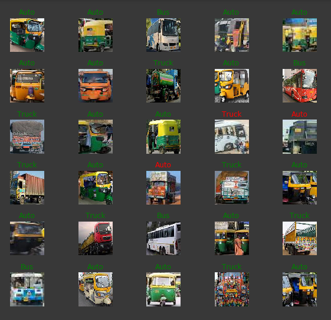

# Auto_Truck_Bus-Classifier
An image classifier to classify images of indian vehicles such as Auto-Rickshaws , Buses and Trucks
Made to aid Google's pre-trained object detection model trained model as Auto-Rickshaws are detected as Buses and Trucks.
Classification is done by Mobilenet v2 model trained on a custom made dataset. Converted to TensorFlow Lite for usage on Mobile Devices.
you can find the dataset used in the project repository. you can train the model with your own dataset but make sure to organize the images inside dataset folder as i have.

# Usage
I used goole colab to train the model , you can do the same or train it locally using the pyhton notebook in the repository by just changing the path to the respective directories.

the trained model had an accuracy of 91%
here are the resluts of preditions for 30 images:

